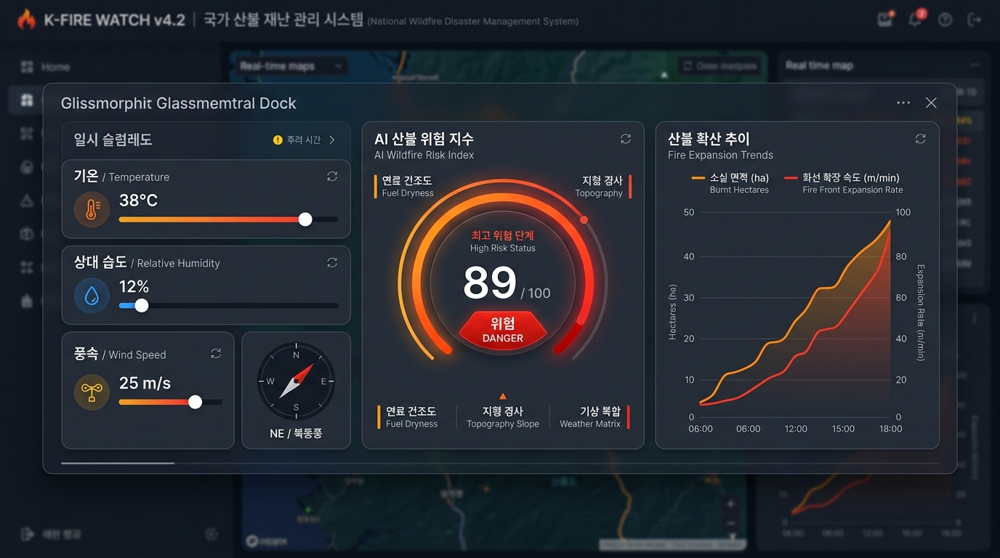
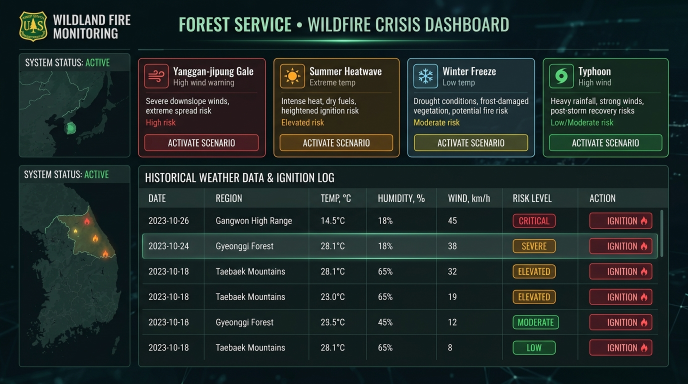

# 🧩 API 및 모듈 레퍼런스 (API & Modules Reference)

본 문서는 **산불 3D 시뮬레이터 (Wildfire 3D Simulation & Control System)**의 소스 코드 내 주요 클래스, 함수, 인터페이스 및 컴포넌트의 상세 명세를 제공합니다.

---

## 1. 전역 타입 정의 (`src/types.ts`)

### 1.1 `CellStatus` (열거형)
개별 지형 격자 셀의 연소 상태를 정의합니다.

```typescript
export enum CellStatus {
  UNBURNED = 0, // 미연소 (정상 식생)
  IGNITING = 1, // 점화 단계 (불꽃 발생 직전)
  BURNING = 2,  // 활성 연소 중 (화염 및 연기 방출)
  BURNED = 3,   // 연소 완료 (탄화목 및 재)
}
```

### 1.2 `TerrainCell` (인터페이스)
격자 내 개별 셀의 물리적 및 상태 데이터를 담습니다.

| 속성명 | 타입 | 설명 |
| :--- | :--- | :--- |
| `x`, `z` | `number` | 격자 인덱스 좌표 ($0 \sim 127$) |
| `height` | `number` | 해발 고도 ($0 \sim 1,450\text{m}$) |
| `status` | `CellStatus` | 현재 연소 상태 (`UNBURNED`, `IGNITING`, `BURNING`, `BURNED`) |
| `fuel` | `number` | 잔여 가연물 밀도 ($0.0 \sim 1.0$) |
| `maxFuel` | `number` | 초기 최대 가연물 밀도 ($0.0 \sim 1.0$) |
| `burnProgress` | `number` | 연소 진행률 ($0.0 \sim 1.0$, $1.0$ 도달 시 BURNED) |
| `temperature` | `number` | 화염 연소 온도 계수 ($0.0 \sim 1.0$) |
| `slopeX`, `slopeZ`| `number` | $X$축, $Z$축 수치 경사도 구배 (Gradient) |
| `treeId` | `number` | 해당 셀 위에 배치된 수목 인덱스 (-1이면 없음) |

### 1.3 `WeatherConditions` 및 `WindConditions` (인터페이스)
광역 기상 환경 변수 및 AI 위험도 필드를 지정합니다.

```typescript
export interface WindConditions {
  speed: number;     // 풍속 (0.0 ~ 45.0 m/s)
  direction: number; // 풍향 방위각 (0 ~ 360°, 0은 북풍)
}

export type RiskLevel = '낮음' | '보통' | '높음' | '매우높음';

export interface WeatherConditions {
  humidity: number;         // 상대 습도 (5 ~ 100 %)
  temperature: number;      // 대기 기온 (-10 ~ 48 ℃)
  wind: WindConditions;     // 풍속 및 풍향
  spottingEnabled: boolean; // 비화(불씨 도약) 활성화 여부
  riskLevel?: RiskLevel;    // AI 산정 위험 등급
  riskScore?: number;       // AI 산정 위험 지수 (0 ~ 100)
}
```

### 1.4 `SimulationStats` (인터페이스)
실시간 관제 HUD 및 통계 차트에 바인딩되는 집계 데이터입니다.

```typescript
export type TerrainScaleMode = '100x';

export interface SimulationStats {
  activeFires: number;       // 활성 연소 셀 수
  burnedAreaHa: number;      // 소실 면적 (ha)
  burnedAreaKm2: number;     // 소실 면적 (km²)
  totalForestHa: number;     // 전체 산림 면적 (ha)
  totalAreaKm2: number;      // 전체 지형 면적 (km², 100 km²)
  burnedPercentage: number;  // 산림 소실률 (0 ~ 100 %)
  spreadRateMMin: number;    // 화선 전파 속도 (m/min)
  elapsedSeconds: number;    // 시뮬레이션 경과 시간 (초)
  peakIntensity: number;     // 현재 화염 최고 강도 (0.0 ~ 1.0)
  scaleMode: TerrainScaleMode; // '100x' 고정
  treeCount?: number;        // 배치된 총 수목 수
}
```

---

## 2. 시뮬레이션 및 AI 모델 모듈

### 2.1 `FireSpreadEngine` (`src/simulation/fireSpreadEngine.ts`)

#### 생성자
```typescript
constructor(initialGrid: TerrainCell[][])
```
* $128 \times 128$ 초기 격자 배열을 받아 $100\text{ km}^2$ 스케일로 엔진을 초기화하고 총 산림 셀 수를 집계합니다.

#### 주요 메서드
* **`update(dt: number, weather: WeatherConditions): SimulationStats`**
  * 경과 시간 $dt$ 동안 활성 화선을 순회하며 연소 진행, 이웃 셀 점화, 비화 발생, 소진 처리를 수행하고 최신 통계를 반환합니다.
* **`ignite(gridX: number, gridZ: number, radius?: number): number`**
  * 지정된 그리드 좌표 중심 반경(`radius`) 내의 미연소 셀들을 즉시 점화합니다. 점화된 셀 수를 반환합니다.
* **`igniteWorld(worldX: number, worldZ: number, radius?: number): number`**
  * Three.js 3D 월드 좌표 $(X, Z)$를 그리드 좌표로 변환하여 점화를 수행합니다. 마우스 클릭 발화에 사용됩니다.
* **`getActiveFireCoordinates(): FireFrontPoint[]`**
  * 3D 파티클 및 동적 조명 갱신을 위해 현재 활성 발화 지점들의 월드 좌표와 온도를 반환합니다.
* **`getFireFrontCenter(): { x: number; y: number; z: number }`**
  * 현재 활발한 화선의 가중 중심 좌표를 산출합니다. 카메라 추적 및 포인트 라이트에 사용됩니다.
* **`reset(newGrid: TerrainCell[][]): void`**
  * 새로운 격자로 시뮬레이션 상태, 통계, 활성 화선을 초기화합니다.

---

### 2.2 `wildfireRiskModel.ts` (`src/simulation/wildfireRiskModel.ts`)

#### 주요 인터페이스 및 상수
* **`WILDFIRE_TRAINING_DATASET: DatasetItem[]`**: 산림청/기상청 실측 기상 100건 데이터셋 (낮음 25건, 보통 25건, 높음 25건, 매우높음 25건).

#### 주요 함수
* **`predictWildfireRisk(weather: WeatherConditions): RiskPredictionResult`**
  * k-최근접 이웃(KNN, $k=7$) 및 거리 가중치 역수 모델과 연속 물리 수식을 결합하여 산불 위험 등급(`낮음`, `보통`, `높음`, `매우높음`), 종합 위험 점수($0 \sim 100$), 등급별 확률(%), 물리 확산 배율(`spreadMultiplier`), 화염 세기 배율(`flameIntensityScale`), 비화 계수(`spottingProbabilityFactor`)를 산출합니다.

---

### 2.3 `terrainData.ts` (`src/simulation/terrainData.ts`)

#### 상수
* `GRID_SIZE`: $128$
* `WORLD_SIZE`: $10,000$ (Three.js 월드 단위 m, $10\text{km}$)
* `CELL_SPACING`: $WORLD\_SIZE / (GRID\_SIZE - 1) \approx 78.74\text{m}$
* `MAX_TERRAIN_HEIGHT`: $1,450\text{m}$ (백두대간 주봉 고도차)

#### 주요 함수
* **`generateTerrainData(): { grid, heights, treePositions }`**
  * 2D Gradient Noise, FBM(Fractional Brownian Motion), Ridged Multifractal Noise 및 도메인 왜곡(Domain Warping)을 조합하여 $100\text{ km}^2$ 백두대간 양식의 산악 지형, 7대 주봉, 계곡 및 경사도를 절차적으로 생성합니다.
  * 쌍선형 보간법(Bilinear Interpolation)을 통해 $16,000$개 이상의 수목 위치를 산악 지표면에 밀착 배치합니다.

---

## 3. 3D WebGL 렌더링 모듈 (`src/three/`)

### 3.1 `SceneManager` (`src/three/SceneManager.ts`)

Three.js 씬 그래프, 카메라, 렌더러, 조명, 조작계 및 마우스 인터랙션을 총괄합니다.

* **`constructor(container, terrain, fireParticles, onIgniteClick)`**
  * WebGLRenderer(ACESFilmicToneMapping, PCFShadowMap), 원근 카메라, 그림자 조명, `OrbitControls` 및 마우스 클릭 이벤트 리스너를 바인딩합니다.
* **`update(rawDt, firePoints, fireFrontCenter, weather)`**
  * 매 프레임 파티클 시뮬레이션, 지형 셰이더, 동적 포인트 라이트 위치 및 조준선(Reticle) 애니메이션을 갱신합니다.
* **`setCameraPreset(preset: CameraPreset, targetPos?: Vector3)`**
  * `orbit`(자유 궤도), `track_front`(화선 전면 추적), `top_down`(위성 수직 뷰) 프리셋으로 카메라 위치와 주시점(LookAt)을 부드럽게 이동시킵니다.
* **`setLightingMode(mode: LightingMode)`**
  * `day`(한낮), `dusk`(노을 황혼), `night`(심야) 환경광 및 안개 색상을 즉시 전환합니다.
* **`handleResize(width: number, height: number)`**
  * 브라우저 리사이즈 시 뷰포트 비율 및 렌더러 해상도를 동기화합니다.

---

### 3.2 `TerrainMesh` (`src/three/TerrainMesh.ts`)

지형 지오메트리와 16,000개 수목 렌더링을 담당합니다.

* **`updateFromGrid(grid: TerrainCell[][]): void`**
  * 연소 진행도(`burnProgress`) 및 상태(`status`)에 따라 정점 색상 버퍼(`BufferAttribute`)를 점진적으로 검게 탄화시키고, 수목의 크기와 색상을 변경합니다.
* **`resetTrees(): void`**
  * 시뮬레이션 초기화 시 수목들의 크기와 녹색 나뭇잎 색상을 원상 복구합니다.

---

### 3.3 `FireParticleSystem` (`src/three/FireParticleSystem.ts`)

다층 파티클 이펙트(화염, 연기, 불씨)를 관리합니다.

* **`flameColumnsMesh` (InstancedMesh, 500개):** 십자 형태(Crossed Quads)의 입체 3D 화염 기둥을 화선 주요 지점에 렌더링.
* **`flameParticles` (Points, 4,200개):** 지표면에서 솟아오르는 불꽃 파티클을 난류 속도로 방출.
* **`smokeParticles` (Points, 4,800개):** 풍속 및 풍향 벡터 방향으로 날아오르며 반투명하게 확산되는 연기 구름을 시뮬레이션.
* **`emberParticles` (Points, 1,600개):** 공중으로 흩날리며 깜빡이는 비산 불씨(Sparks)를 연출.
* **`clear(): void`** 모든 파티클의 수명을 0으로 리셋.

---

## 4. UI 컴포넌트 (`src/components/`)

<div align="center">
  
  <p align="center"><em>▲ IntegratedControlHub: 기상 제어 슬라이더, AI 위험도 지수 게이지, Recharts 실시간 차트</em></p>
</div>

### 4.1 `IntegratedControlHub` (`src/components/IntegratedControlHub.tsx`)
* **역할:** 통합 GIS 재난 관제 콘솔 허브.
* **구조:**
  * **상단 글로벌 텔레메트리 바:** 활성 화선 수, 소실 면적(ha 및 km²), 전파 속도(m/min), 경과 시간, 카메라 프리셋, 조명 모드, 뷰포트 전체 화면 토글.
  * **우측 통합 관제 독 (3개 탭):**
    1. *기상 제어:* 기온(-10~48℃), 습도(5~100%), 풍속(0~45m/s), 8방위 원터치 풍향, 비화 토글, 4대 대표 기상 프리셋.
    2. *피해 분석:* AI 종합 위험도 지수 게이지, 4단계 위험 등급 및 확률 분포, 내장 `FireStatsDashboard`.
    3. *시나리오·DB:* 4대 위기 시나리오 및 산림청 100건 실측 기상 데이터 탐색기(검색/필터/원클릭 발화).
  * **하단 재생 컨트롤러:** 재생/일시정지, 지형 초기화, 1x~60x 가속 버튼, 실시간 기상 상태 요약 칩.

<div align="center">
  
  <p align="center"><em>▲ 시나리오·DB 탭: 4대 위기 시나리오 카드 및 산림청(KFS) 100건 데이터베이스 테이블</em></p>
</div>

### 4.2 `FireStatsDashboard` (`src/components/FireStatsDashboard.tsx`)
* **역할:** Recharts 기반 실시간 화재 피해 및 화선 추이 시각화 대시보드.
* **기능:**
  * 실시간 소실 면적(ha) 누적 증가 곡선 (AreaChart)
  * 활성 화선 수(개) 변동 추이 선 그래프 (LineChart)
  * 최근 60초간의 시계열 데이터 자동 슬라이딩 윈도우 갱신
