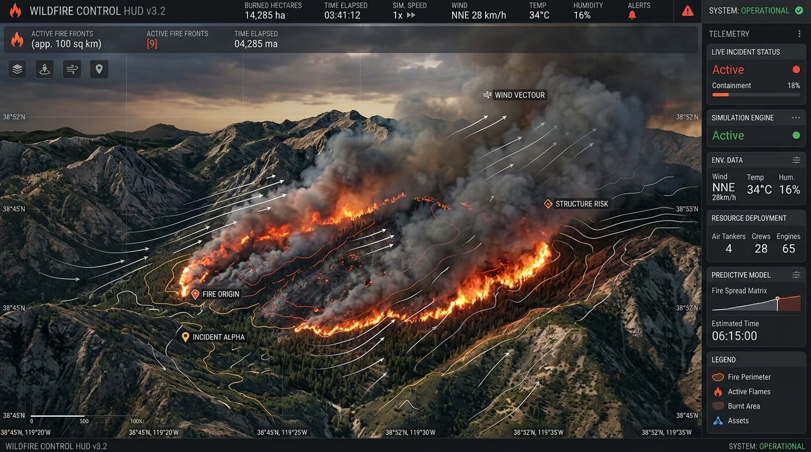

# 🚢 프로덕션 배포 가이드 (Deployment Guide)

본 문서는 **산불 3D 시뮬레이터 (Wildfire 3D Simulation & Control System)**를 다양한 클라우드 및 온프레미스 환경에 배포하는 절차와 최적화 구성을 안내합니다.

---

## 1. 빌드 개요

<div align="center">
  
  <p align="center"><em>▲ 프로덕션 번들(Vite 6.2 + WebGL)로 빌드된 60 FPS 무결점 3D 관제 인터페이스</em></p>
</div>

본 애플리케이션은 순수 클라이언트 기반 SPA(Single Page Application)로 번들링되므로, 별도의 백엔드 데이터베이스 서버 없이 정적 웹 서버(Nginx, Caddy, Apache) 또는 글로벌 정적 호스팅 서비스(GitHub Pages, Vercel, Cloudflare Pages, Netlify)에서 즉시 구동 가능합니다.

### 프로덕션 빌드 명령
```bash
npm run build
```

빌드 완료 시 프로젝트 루트의 `/dist` 디렉터리에 다음 파일들이 생성됩니다:
```text
dist/
├── index.html               # 메인 HTML 엔트리포인트
├── assets/
│   ├── index-[hash].js      # 압축 최적화된 TypeScript/React/Three.js 번들
│   └── index-[hash].css     # Tailwind CSS 컴파일 스타일시트
└── ...
```

---

## 2. 정적 호스팅 플랫폼 배포

### 2.1 GitHub Pages 배포 (GitHub Actions)

저장소의 `.github/workflows/deploy.yml` 파일에 다음 워크플로우를 생성하면 `main` 브랜치 푸시 시 자동 배포됩니다:

```yaml
name: Deploy to GitHub Pages

on:
  push:
    branches: [main]

permissions:
  contents: read
  pages: write
  id-token: write

jobs:
  build-and-deploy:
    runs-on: ubuntu-latest
    steps:
      - name: Checkout repository
        uses: actions/checkout@v4

      - name: Setup Node.js
        uses: actions/setup-node@v4
        with:
          node-version: 20
          cache: 'npm'

      - name: Install dependencies
        run: npm ci

      - name: Build application
        run: npm run build

      - name: Setup Pages
        uses: actions/configure-pages@v4

      - name: Upload artifact
        uses: actions/upload-pages-artifact@v3
        with:
          path: './dist'

      - name: Deploy to GitHub Pages
        id: deployment
        uses: actions/deploy-pages@v4
```

> **주의 (Base Path):** 만약 `https://<username>.github.io/<repo-name>/` 하위 경로로 배포할 경우, `vite.config.ts`의 `base` 속성을 `'/<repo-name>/'`로 지정해야 정적 자산 경로가 정상 로드됩니다.

---

### 2.2 Vercel 배포

```bash
# Vercel CLI를 통한 원클릭 배포
npm install -g vercel
vercel --prod
```
* **Framework Preset:** `Vite`
* **Build Command:** `npm run build`
* **Output Directory:** `dist`

---

### 2.3 Cloudflare Pages

1. Cloudflare 대시보드에서 **Workers & Pages** $\rightarrow$ **Create Application** $\rightarrow$ **Pages** $\rightarrow$ **Connect to Git** 선택.
2. 빌드 설정:
   * **Framework preset:** `Vite`
   * **Build command:** `npm run build`
   * **Build output directory:** `dist`

---

## 3. Docker 컨테이너 배포 (Nginx)

운영 환경에서 Docker 또는 Kubernetes를 사용하여 배포할 경우, 아래의 멀티 스테이지 빌드 Dockerfile을 사용합니다.

### 3.1 `Dockerfile`
```dockerfile
# Stage 1: Build stage
FROM node:20-alpine AS builder
WORKDIR /app

# 패키지 매니저 캐시 활용
COPY package*.json ./
RUN npm ci

# 소스 복사 및 빌드
COPY . .
RUN npm run build

# Stage 2: Production Nginx stage
FROM nginx:alpine
COPY --from=builder /app/dist /usr/share/nginx/html
COPY nginx.conf /etc/nginx/conf.d/default.conf

EXPOSE 80
CMD ["nginx", "-g", "daemon off;"]
```

### 3.2 `nginx.conf` (SPA 라우팅 및 정적 캐시 설정)
```nginx
server {
    listen 80;
    server_name localhost;
    root /usr/share/nginx/html;
    index index.html;

    # Gzip 압축 활성화 (Three.js 대용량 번들 전송 최적화)
    gzip on;
    gzip_types text/plain text/css application/json application/javascript text/xml application/xml application/xml+rss text/javascript;
    gzip_min_length 1000;

    # SPA Fallback 라우팅
    location / {
        try_files $uri $uri/ /index.html;
    }

    # 정적 자산 장기 캐싱
    location ~* \.(js|css|png|jpg|jpeg|gif|svg|ico|woff|woff2)$ {
        expires 1y;
        add_header Cache-Control "public, immutable";
    }
}
```

### 3.3 Docker 빌드 및 실행
```bash
# 이미지 빌드
docker build -t wildfire-3d-sim:latest .

# 컨테이너 실행 (80번 포트 연결)
docker run -d -p 8080:80 --name wildfire-app wildfire-3d-sim:latest
```
웹 브라우저에서 `http://localhost:8080`으로 접속하여 확인합니다.

---

## 4. 운영 환경 브라우저 요구 사항 및 유의점

1. **WebGL 2.0 지원:**
   * 최신 크롬, 엣지, 파이어폭스, 사파리 브라우저(하드웨어 가속 활성화 필수).
2. **GPU 메모리 권장 사양:**
   * 16,000+ 수목 인스턴싱 및 섀도 맵 처리를 위해 VRAM 1GB 이상의 GPU가 권장됩니다.
3. **HTTPS 보안 컨텍스트:**
   * 모바일 자이로스코프 센서 또는 최신 WebGL 확장 기능 사용을 위해 HTTPS 도메인 적용을 강력히 권장합니다.
