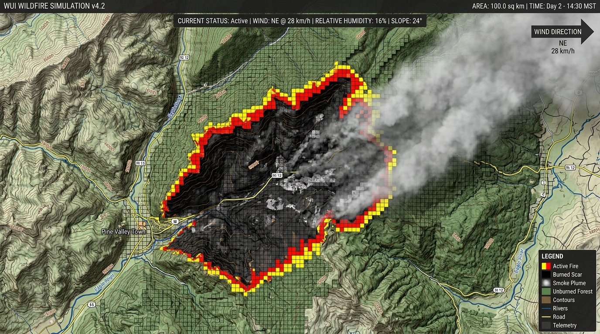
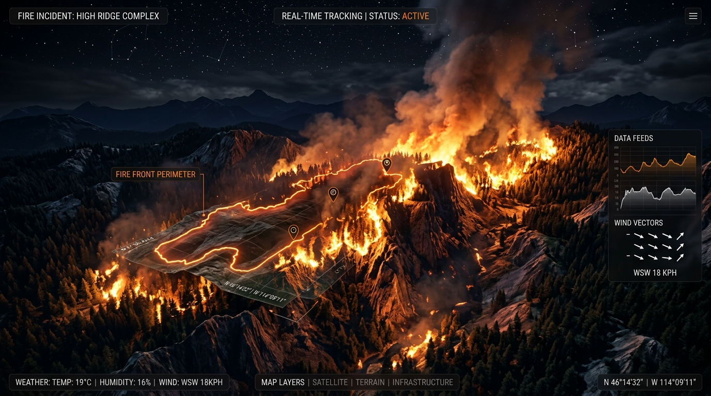

# 📖 사용자 조작 및 시뮬레이션 가이드 (User & Tutorial Guide)

본 문서는 **산불 3D 시뮬레이터 (Wildfire 3D Simulation & Control System)**의 대시보드 인터페이스 사용법, 3D 뷰포트 조작, 기상 인자 제어 및 대표 재난 시나리오 실습 절차를 안내합니다.

<div align="center">
  
  <p align="center"><em>▲ 산불 3D 시뮬레이터 메인 관제 콘솔 전경</em></p>
</div>

---

## 1. 인터페이스 레이아웃 (Interface Layout)

관제 대시보드는 3D WebGL 뷰포트 위에 3개 주요 HUD 모듈로 구성되어 있습니다:

```text
+-----------------------------------------------------------------------------------+
| 1. 글로벌 텔레메트리 헤더 (Global Telemetry Bar)                                   |
|    [활성 화선] [소실 면적] [소실률] [확산 속도] [경과 시간] | [카메라] [조명] [패널토글] |
+-----------------------------------------------------------------+-----------------+
|                                                                 | 2. 통합 관제 독 |
|                                                                 |    (Right Dock) |
|                     3D WebGL 산악 지형 뷰포트                    |   [기상 제어]   |
|                 (100 km² 백두대간급 산림 모델)                  |   [피해 분석]   |
|                                                                 |   [시나리오·DB] |
|                                                                 |                 |
+-----------------------------------------------------------------+-----------------+
| 3. 하단 재생 컨트롤러 (Bottom Dock)                                               |
|    [재생/정지] [초기화] [1x/5x/15x/60x 배속] | [실시간 기상 상태 요약 칩]          |
+-----------------------------------------------------------------------------------+
```

---

## 2. 3D 뷰포트 조작법 (3D Viewport Controls)

| 동작 | 마우스 / 트랙패드 입력 | 동작 설명 |
| :--- | :--- | :--- |
| **산불 임의 발화 (Ignition)** | **마우스 좌클릭** | 3D 지형의 임의 지점을 클릭하면 해당 능선/골짜기에 즉시 화재가 점화됩니다. |
| **시점 궤도 회전 (Orbit)** | **마우스 좌클릭 드래그** | 100 km² 산악 모델을 중심으로 카메라 각도를 360° 자유롭게 회전합니다. |
| **화면 평면 이동 (Pan)** | **마우스 우클릭 드래그** | 카메라 시점 위치를 전후좌우 수평면으로 이동합니다. |
| **확대 및 축소 (Zoom)** | **마우스 휠 스크롤** | 세부 화선과 수목 연소 상태를 확대하거나 광역 조감도로 축소합니다. |

<div align="center">
  
  <p align="center"><em>▲ 상단 우측 카메라 메뉴에서 '조감도(Top-Down)' 선택 시 100 km² 전체 화선 윤곽을 위성뷰로 관찰</em></p>
</div>

---

## 3. 우측 관제 독 세부 기능 (Right Control Dock)

<div align="center">
  
  <p align="center"><em>▲ 기상 조건 실시간 조절 및 머신러닝 AI 위험 지수 게이지</em></p>
</div>

### 3.1 기상 제어 탭 (Weather Control)
* **대기 기온:** $-10^\circ\text{C} \sim 48^\circ\text{C}$ 범위에서 조절 (기온 상승 시 가연물 예열로 확산율 증가)
* **상대 습도:** $5\% \sim 100\%$ 범위에서 조절 (습도 $20\%$ 이하 시 건조 경보 발령 및 발화율 급증)
* **풍속:** $0.0 \sim 45.0\text{ m/s}$ 연속 조절 ($25\text{m/s}$ 이상 시 태풍/양간지풍 급 전파)
* **8방위 풍향 선택:** N, NE, E, SE, S, SW, W, NW 8개 방향을 원클릭으로 지정 (풍향에 맞춰 파티클과 연기 기둥이 자동 정렬)
* **비화(Spotting) 토글:** 강풍 시 불씨가 $200\text{m} \sim 1.5\text{km}$ 전방으로 튀어 새로운 불씨를 만드는 현상 On/Off
* **원터치 극한 기상 프리셋:**
  * 🌪️ **영동 양간지풍:** $22^\circ\text{C}$, 습도 $12\%$, 서풍 $28\text{m/s}$
  * ❄️ **겨울 한파 건조:** $-6^\circ\text{C}$, 습도 $15\%$, 북서풍 $16\text{m/s}$
  * ☀️ **폭염 가뭄 경보:** $42^\circ\text{C}$, 습도 $8\%$, 남서풍 $12\text{m/s}$
  * 🌀 **태풍급 돌풍:** $25^\circ\text{C}$, 습도 $45\%$, 동남동풍 $42\text{m/s}$

### 3.2 피해 분석 탭 (Damage Analytics)
* **AI 산불 종합 위험도 지수:** 0~100점 점수 및 원형 게이지 표시
* **위험 등급 배지:** `낮음`(안전 초록), `보통`(주의 노랑), `높음`(경계 주황), `매우높음`(심각 빨강)
* **실시간 Recharts 차트:**
  * 누적 소실 면적 추이 (Area Chart)
  * 활성 화선(발화점) 수 변동 추이 (Line Chart)

### 3.3 시나리오 & 데이터셋 탭 (Scenarios & KFS 100 Database)

<div align="center">
  
  <p align="center"><em>▲ 4대 대표 재난 시나리오 및 산림청(KFS) 100건 실측 기상 데이터 탐색기</em></p>
</div>

* **산림청(KFS) 100건 실증 기상 데이터:**
  * 지역, 측정 일시, 기온, 습도, 풍속, 위험 등급 실측 데이터 100건 수록
  * 지역명 검색 및 위험 등급별 필터링 지원
  * 각 행의 **'적용 & 발화'** 버튼 클릭 시 해당 기상 조건이 즉시 동기화되고 3D 지형에 산불이 점화됨

---

## 4. 조명 모드 및 야간 시뮬레이션

<div align="center">
  
  <p align="center"><em>▲ 심야(Night) 조명 모드: 화선 중심의 동적 포인트 라이트가 어두운 산악 협곡을 투사</em></p>
</div>

* **주간(Day):** 맑은 대낮 조명으로 전체 지형 등고선과 수목 분포 파악에 용이
* **황혼(Dusk):** 붉은 노을 빛 아래 화염과 연기 기둥의 대비를 극대화
* **심야(Night):** 칠흑 같은 어둠 속에서 활성 화선 3개의 동적 포인트 라이트와 불씨 스파크의 궤적을 실감 나게 감상

---

## 5. 단계별 실습 시나리오 (Step-by-Step Tutorial)

### 튜토리얼 1: 영동 양간지풍 산불 확산 실험
1. 우측 관제 독에서 **[기상 제어]** 탭을 선택합니다.
2. 상단의 **'양간지풍(28m/s)'** 프리셋 버튼을 클릭합니다.
3. 3D 산악 지형의 서쪽(화면 좌측) 능선 지점을 **마우스 좌클릭**하여 점화합니다.
4. 하단 재생바에서 **'5x'** 또는 **'15x'** 배속 버튼을 클릭합니다.
5. 화선이 서풍을 타고 동쪽 능선과 주봉을 향해 수치적·물리적으로 폭발적으로 전파되는 과정을 관찰합니다.
6. 비화(Spotting)에 의해 바람 앞쪽 $1\text{km}$ 전방으로 새로운 불씨가 날아가 발화하는 현상을 확인합니다.

### 튜토리얼 2: 실시간 진화 및 지형 초기화
1. 하단 재생바의 **'일시정지'** 버튼을 누르면 연산이 정지되어 현재 상태를 동결 분석할 수 있습니다.
2. **'지형 초기화'** 버튼을 누르면 모든 탄화된 산림과 화염 파티클이 초기 녹색 수목 상태로 즉시 복원됩니다.
